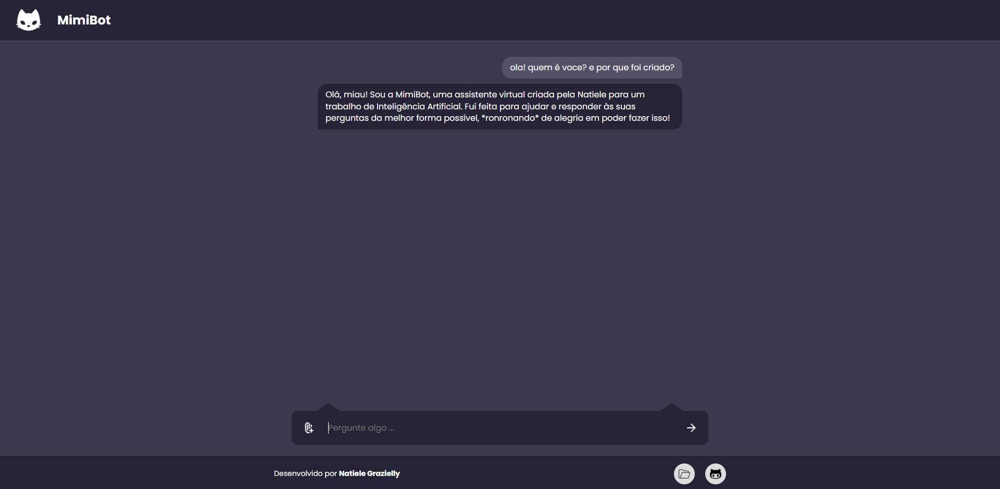

# MimiBot - Chatbot com a API do Google Gemini



## Sobre o Projeto

O **MimiBot** é um chatbot interativo e multimodal desenvolvido como projeto para a disciplina de Inteligência Artificial do Instituto Federal do Piauí (IFPI). Orientado pelo Professor Otílio, o projeto foi criado pela aluna **Natiele Grazielly**.

O nome "MimiBot" é uma homenagem ao gato de estimação da desenvolvedora, Mimi, que já faleceu. O chatbot busca incorporar uma personalidade amigável e com um toque de humor felino em suas interações. Ele é capaz de processar tanto texto quanto imagens, utilizando o poder do modelo `gemini-1.5-flash-latest` da Google.

### ✨ Funcionalidades

- **Inteligência Artificial Conversacional:** Responde a uma vasta gama de perguntas utilizando a API do Google Gemini.
- **Análise Multimodal:** Capacidade de receber e interpretar imagens enviadas pelo usuário junto com um prompt de texto.
- **Personalidade Customizada:** O bot possui uma persona pré-definida via "System Instructions", agindo como um assistente amigável e espirituoso.
- **Interface Responsiva:** O design se adapta a diferentes tamanhos de tela, de desktops a celulares.
- **Experiência do Usuário Aprimorada:** Inclui um indicador de "digitando" (`Miando respostas...`) e uma interface de prévia de imagem com opção de remoção.
- **UI Personalizada:** Elementos de design customizados, como as "orelhas" no campo de input e a barra de rolagem estilizada, para criar uma identidade visual única.

---

## 🛠️ Ferramentas e Tecnologias Utilizadas

O projeto foi construído utilizando um conjunto de tecnologias modernas para frontend e backend:

### **Frontend**
- **HTML5:** Estrutura semântica do conteúdo.
- **CSS3:** Estilização, responsividade e animações.
- **JavaScript (Vanilla JS):** Manipulação do DOM, interatividade e comunicação com o backend (via Fetch API).

### **Backend**
- **Node.js:** Ambiente de execução para o servidor JavaScript.
- **Express.js:** Framework para a construção do servidor e das rotas da API.
- **Google Generative AI SDK (`@google/generative-ai`):** Kit de desenvolvimento oficial para interagir com a API do Gemini.
- **Dotenv:** Para gerenciamento seguro das chaves de API em ambiente de desenvolvimento.

### **Hospedagem**
- **Render:** Plataforma PaaS (Platform as a Service) para hospedagem do servidor Node.js, com um link público e plano gratuito.
- **Link:** https://mimi-bot-gemini.onrender.com
---

## 🚀 Como Rodar o Projeto Localmente

Para executar o MimiBot em seu ambiente de desenvolvimento, siga os passos abaixo.

### **Pré-requisitos**

- **Node.js:** Versão 18 ou superior. (Vem com o `npm`, o gerenciador de pacotes).
- **Git:** Para clonar o repositório.
- **Chave de API do Google Gemini:** É necessário ter uma chave de API válida. Você pode obtê-la no [Google AI Studio](https://ai.google.dev/makersuite).

### **Passo a Passo**

1.  **Clone o Repositório**
    Abra seu terminal e clone o projeto para sua máquina:
    ```bash
    git clone URL_DO_SEU_REPOSITORIO_NO_GITHUB
    ```

2.  **Navegue para a Pasta do Projeto**
    ```bash
    cd nome-da-pasta-do-projeto
    ```

3.  **Crie o Arquivo de Ambiente**
    Crie um arquivo chamado `.env` na raiz do projeto. Este arquivo guardará sua chave de API secreta. Adicione a seguinte linha a ele:
    ```
    GEMINI_API_KEY=SUA_CHAVE_API_VEM_AQUI
    ```
    *Substitua `SUA_CHAVE_API_VEM_AQUI` pela sua chave real.*

4.  **Instale as Dependências**
    Este comando irá ler o `package.json` e instalar todas as ferramentas necessárias (Express, Gemini SDK, etc.).
    ```bash
    npm install
    ```

5.  **Inicie o Servidor**
    Este comando irá executar o arquivo `index.js` e ligar o servidor local.
    ```bash
    npm start
    ```

6.  **Acesse no Navegador**
    Após ver a mensagem `⭐ Servidor rodando no http://localhost:3000` no terminal, abra seu navegador e acesse o seguinte endereço:
    [http://localhost:3000](http://localhost:3000)

Pronto! O MimiBot estará funcionando em sua máquina.

---

## 📂 Estrutura do Projeto

```
/
├── public/
│   ├── index.html         # Estrutura principal do frontend
│   └── src/
│       ├── js/
│       │   └── script.js  # Lógica do frontend
│       ├── styles/
│       │   └── style.css  # Estilização
│       └── imgs/          # Imagens e ícones
│
├── .env                   # Arquivo para as chaves de API (local)
├── .gitignore             # Arquivos a serem ignorados pelo Git
├── index.js               # Servidor backend (Express + Gemini)
├── package.json           # Definições e dependências do projeto
└── README.md              # Este arquivo :)
```

---

## 🎓 Agradecimentos

Agradeço ao Professor Otílio pela orientação e pelos conhecimentos compartilhados durante a disciplina, que foram fundamentais para a concepção e desenvolvimento deste projeto.

---

Desenvolvido com 💙 por **Natiele Grazielly**.
